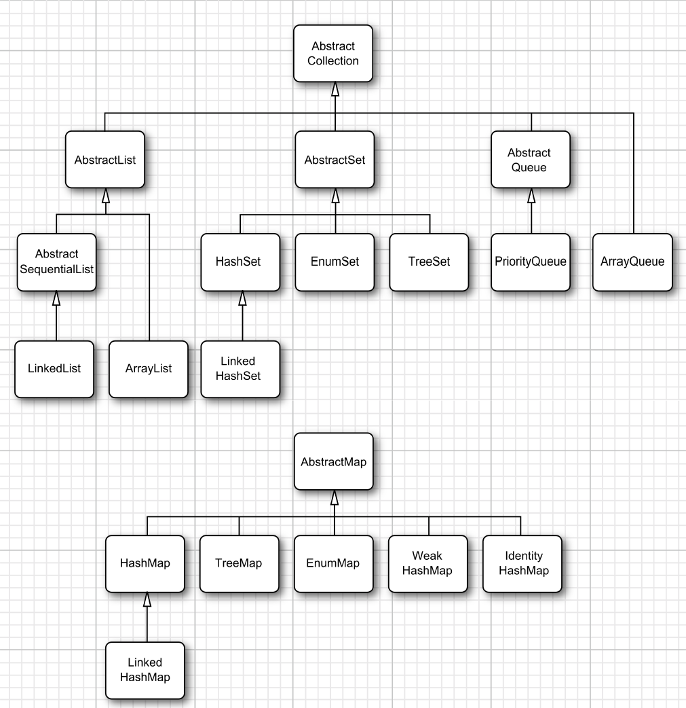

# Chapter 1
The Java compiler generate bytecode instructions which have nothing to do with a particular computer architecture.
# Chapter 3

## Comment

Three ways of comment:
+ // is used in a single line
+ /* */ is used for a block
+ /** */ is used to generate documentation

## Data Type

Java is a strongly typed language.

Java has 8 primitive types `int`, `short`, `long`, `byte`, `float`, `double`, `char`, `boolean`.

If you need precise numerical computations without roundoff errors, use the `BigDecimal` class.

## Variable

The length of a variable name is essentially unlimited in Java.

In Java, you use the keyword `final` to denote a constant and it is customary to name constants in all uppercase.

## Operator

Integer division by 0 raises an exception, whereas floating-point division by 0 yields an infinite or NaN result.

int->float, long->double, long->float might lose precision. Integer is  32 bit, and float only use 23 bit to represent significand digit. Long is 64 bit, and double only use 52 bit to represent significand digit which lacks precision.

Whenever not sure about operator precedence, use parentheses.

## String
Java doesn't have a built-in string type, instead, the standard Java library contains pre-defined class called `String`.

`substring(start, end)` => [start, end)

When you concatenate a string with a value that is not a string, the latter is converted to a string. (every java object can be converted to a string)

Strings are immutable.

Use `equals` to test whether two strings are euqal and **never** ~~use `==`~~.

Sometimes you need to test that a string is neither `null` nor empty, then you need to test that string is not null first.

Every time you concatenate strings, a new `String` object is constructed. So use `StringBuilder` to build up strings from shorted strings

You can use the static `String.format` method to crate a formatted string without printing it.

## Arrays

`for (variable : collection) statement`

The `collection` expression must be an arrya or an object of a class that implements the `Iterable` interface.

You can copy one array variable into another, but then **both variables refer to the same array**. If you want to copy all values of one array into a new array, which is deep copy, you use the `Arrays.copyOf` method.

# Chapter 4 Objects and Classes
A constructor is a special method whose purpose is to construct and initialize objects.

Constructors always have the same name as the class name.

It is important to realize that an object variable doesn't actually contain an object. It only refers to an object. In Java, the value of any object variable is a reference to an object that is stored elsewhere.

The return value of the `new` operator is also a reference.

You can only have one `public` class in a source file and the name of the file must match the name of the that `public` class.

Variables of objects are called instance field.

A constructor can only be called in conjunction with the `new` operator

A method can access the private data of all objects of its class. (conside the `equals` example on Page 156)

Make all your instance fields `private`.

Do not write accessor methods that return references to mutable objects. If needed, you should clone it first.

`final` instance field must be initialized when the object is constructed, after which the field can't be modified again.

If you define a field as `static`, then there is only one such field per class which is shared among all instances of the class. Static fields are called `class fields` in some object-orientend programming languages.

use `static final` to declare static constant.

A method has two types of parameters, one is implicit parameter which is the object itself and the other is explicit parameters which are provided via method. In everty method, the  keyword `this` refers to the implicit parameter.

Static method are methods that do not operate on objects. You can think of `static` methods as methods that don't have a `this` parameter.

A static method can not access instance field but it can access a `static` field.

Use static method in two situations:
+ When a method doesn't need to access the object state because all needed parameters are supplied as explicit parameters
+ When a method only needs to access static fields of the class.

You can call static methods without having any objects, e.g. you never construct any objects of the `Math` class to call `Math.pow`.

The `main` method doesn't operate on any objects. When a program starts, there aren't any objects yet.

Every class can have a main method which is a handy trick for unit testing of classes.

**Call by value** means that the method gets the value that the caller provides. In contrast, **call by reference**  means that the method gets the location of the variable that the caller provides. Thus, a method can modify the value stored in a variable passed by reference but not in one passed by value.

**The Java programming language always uses call by value.** That means the method gets a copy of all parameter values.

Java has two kinds of (explicit) method parameters:
+ primitive type
+ object reference

The method gets a copy of the object reference, and both the original and the copy refer to the same object.

What you can and cannot do with method parameters:
+ A method cannot modify a parameter of a primitive type
+ A method can change the state of an object parameter
+ A method cannot make an object parameter refer to a new object

`Overloading` occurs if serveral methods have the same name but different parameters.

Default field initialization:
+ numbers to 0
+ boolean to false
+ object reference to null

Fields and local variables are different. You must always explicitly initialize local variables in a method. But if you don't  initialize a field, it is automatically initialized to a default.

A constructor with no arguments would create an object whose state is set to an appropriate default. If you write a class with no constructor, then a no-argument constructor is provided. If a class supplies at least one constructor but doesn't supply a no-argument constructor, it's illegal to construct objects without supplying arguments.

You can simpy assign a value or a **method call** to any field in the class definition. It is particularly useful if all constructors of a class need to set a particular instance field to the same value.

If the first statement of a constructor has the form `this(...)`, then the constructor calls another constructor of the same class.

You can also initialize fields via `initialization block` which is not necessary and is not common. Initialization blocks are executed whenever an object of that class is constructed. It looks like:
```java
class Whatever{
    private bla;
    
    //object initialization block
    {
        bla = 1;
    }
}
```

Three ways to initialize a field:
1. setting it in a constructor
2. explicit field initialization which is assigh a value or a method call to a field in the class definition
3. initialization

When a constructor is called:
1. All data fields are initialized to their default values.
2. All fields initializers and initialization blocks are executed, in the order in which they occur in the class declaration.
3. If the first line of the constructor calls a second constructor, then the body of the second constructor is executed.
4. The body of the constructor is executed.

To initialize a static field, either supply an initial value or use a static initialization block.

## Package

The main reason for using packages is to guarantee the uniqueness of class names.

A top-level class is either `public` or `package` while `package` is often ommited.

A class can use all classes from its own package and all public classes from other packages as long as you import those packages.

If you don't put a package statement in the source file, then the classes in that file belong to the *default* package.

If you don't specify either `public` or `private` to the feature, then the feature (class, method, variable) can be accessed by all methods in the same package.

## Class Design Hints
1. Always keep data private.
2. Always initialize data.
3. Don't use too many basic types in a class.
4. Not all fields need individual field accessors and mutators.
5. Break up classes that have too many responsibilities.
6. Make the names of your classes and methods reflect their responsibilities.
7. Prefer immutable classes.

# Chapter 5 Inheritance

## inheritance

Use `extends` to denote inheritance. Each class can have only one superclass.

When defining a subclass, you only need to indicate the difference between the subclass and the superclass. All features except private features are inherited from superclass. Use `super.method` to call `method` from superclass.

If the subclass constructor does not call a superclass constructor explicitly, the no-argument constructor is invoked. If the superclass does not have a no-argument constructor and the subclass consturctor does not call another superclass constructor explicitly, the Java compiler reports an error.

`super` keyword can invoke a superclass method and invoke a superclass constructor.

The fact that an object variable can refer to multiple actual types is called `polymorphism`. Automatically selecting the appropriate method at runtime is called **`dynamic binding`**.

In the Java programming language, object variables are polymorphic which means it can refer an object of type it declared or to an object of any subclass of the declared class. However, you can't call method from subclass via superclass variable even though that superclass variable refers to a subclass reference, which would be a **compile-time error**.

When you call `x.f(args)` and the implicit parameter x is declared to be a object of class `C`. Here is what happens then:
1. The compiler looks at the declared type of the object and the method name. The compiler enumerate all methods called `f` in the class C and all accessible methods called `f` in the superclasses of C.
2. Next, the compiler determines the types of the arguments that are supplied in the method call. If among all the methods called `f` there is a unique one whose parameter types are a best match for the supplied arguments, that method is chosen. This process is called overloading resolution. If the compiler cannot find a match or if multiple methods all match, the compiler reports an error.
3. If the method is `private`, `static`, `final`, or a constructor, then the compiler knows which method to call. This is called `static binding`. Otherwise, the method to be called depends on the actual type of the implicit parameter.
4. When the program runs and uses dynamic binding to call a method, the virtual machine must call the version of the method that is appropriate for the actual type of the object to which `x` refers. If the actual type of `x` is D, a subclass of C. If the class D defines a method `f(String)`, that method is called. If not, D's superclass is searched for a method `f(String)`. To avoid the overhead of search, the virtual machine precomputes a method table for each class which is used for search.

`Static binding` happens at compiling time and **`Dynamic binding`** happens at runtime. You should pass the step 1 and 2 to avoid compile time error. That's why a superclass variable can't call a method from subclass even though that variable might refer to a subclass object. Then if it is not static binding, the dynamic binding would happen at runtime.

`final` classes cannot be extended.

`final` method cannot be override by subclass. All methods in a `final` class are automatically `final`.

You can assign a subclass reference to a superclass variable(**promise less**), but you can't assign a superclass reference to a subclass variable(**promise more**), which would be a **compile-time error**. 

You can cast a subclass reference to superclass, but you can't cast a superclass reference to subclass, which would raise a **runtime error**. You can cast only within an inheritance hierachy. If you cast without an inheritance, there will be an **compile-time error**.

```java
x instanceof C
```
does not raise an exception if x is null. Instead, it simply returns `false`. Also, it would return whether the **actual type** of x is instance of C.

You don't have to implement an `abstract` method. A class with one or more abstract methods must itself be declared abstract. 

A abstract class can have fields and concrete methods. Abstract methods act as placeholders for methods that are implemented in the subclasses.

When extending an abstract class, you can leave some or all of the abstract methods undefined; then you must tag the subclass as abstract as well. Or you can define all methods, and the subclass is no longer abstract.

A class can even be declared as `abstract` though it has no abstract methods.

Abstract classes cannot be instantiated. But you can still create object variables of an abstract class, but it must refer to an object of a nonabstract subclass.

`protected` features can be accessed by subclasses.

```java
subclass instanceof superclass == true
superclass instanceof subclass == false
```

## Object class

Every class in Java extends `Object`. You can use a variable of type `Object` to refer to objects of any type. In Java, only the value of **primitive types**(numbers, characters and boolean values) are not objects.

All array types, no matter whether they are arrays of objects or arrays of primitive types, are class types that extend the `Object` class. That's why when you copy one array variable into another, then both variables refer to the same array.(because array itself is also a object)

The `equals` method in the `Object` class tests whether one object is considered equal to another. The implementation in the `Object` class is compare whether two object references are identical.

You can also implement state-based equality testing, where two objects are considered equal when they have the same state.

recipe for writing a perfect `equals` method:
1. name the explicit parameter otherObject
2. test whether `this` happens to be identical to otherObject
3. test whether otherObject is null
4. compare the classes of this and otherObject. If the semantics of equals can change in subclasses, use the `getClass` test to ensure two classes are exactly same. If the same semantics holds for all subclasses, which means the notion of equality is fixed in the superclass, you can use an `instanceof` test.
5. cast `otherObject` to a variable of your class type
6. compare fields, use `==` for primitive type fieldsm, `Objects.equals` for object fields. If you reach this step in the implementation of `equals` for subclass, then the subclass probably has its own semantics of equality which means you should use `getClass` in step 4.

If you redefine `equals` in a subclass, include a call to `super.equals(other)`. I think you might have to use `getClass` test in this situation because you redefine `equals` and the semantics of equals might change. After include the `super.equals(other)`, you can start from step 5 because the previous 4 steps are done by `super.equals(other)`.

If you don't redefine `equals` in a subclass, which means the notion of equality is fixed in the superclass. Then every time you call `equals` from subclass, it will automatically call the `equals` from superclass via **`dynamic binding`**. Then you might use `instanceof` test in the `equals` of superclass instead of `getClass` test to allow objects of different subclasses to be equal to one another.

Every object has a default hashcode.

Whenever an object is conctenated with a string by the "+" operator, the Java compiler automatically invokes the `toString` method to obtain a string representation of the object.

If you want to print arrays, do not use `toString`. Instead, use `Arrays.toString`, which is what you want.

## Generic ArrayList

`ArrayList` is similar to an array, but it can automatically adjusts its capacity as you add and remove elements.

If you call `add` and the internal array of ArrayList is full, it automatically creates a bigger array and copies all the objects from the smaller to the bigger array. 

You can call the `trimToSize` to adjust the size of the memory block to use exactly as much storage space as is required to hold the elements. You should only use `trimToSize` when you are sure you won't add any more elements to the array list.

Inserting and removing elements in `ArrayList` is not very efficient. Use linked list if you want to store many elements and frequently insert and remove in the middle of a collection.

## Object wrappers and autoboxing
All primitive types have class counterparts which are called wrappers.

The wrapper classes are immutable and are also `final` which means you cannot subclass them.

`ArrayList<Integer>` is far less efficient thant an `int[]` array because each value is separately wrapped inside an object.

```java
ArrayList<Integer> list = new ArrayList<>();
```
`list.add(3)` is automatically translated to `list.add(Integer.valueOf(3))`. This conversion is called autoboxing. Autoboxing is done by compiler not the virtual machine.

Call the `equals` method when comparing wrapper objects.

## Methods with a vriable number of parameters
The ellipsis `...` is part of the Java code. It denotes that the method can receive an arbitrary number of objects.

## Design hints for inheritance
1. Place common operations and fields in the superclass.
2. Don't use protected fields.
3. Use inheritance to model the "is-a" relationship.
4. Don't use inheritance unless all inherited methods make sense.
5. Don't change the expected behavior when you override a method
6. Use polymorphism, not type information.
7. Don't overuse reflection.

## Chapter 6 Interface

An interface is a set of requirement for the classes that want to conform to the interface.

All methods of an interface are automatically public.

Interface never have instance field but it can have constants which are always `public static final`.

Once you define a class that implements an interface, you have to supply definitions for all methods in the interface.

Interface can also be extended.

Interfaces are not classes, which means you can never use the `new` operator to instantiate an interface. But you can still declare an interface variable as long as it refer to an object of a class that implement the interface.

You can use `instanceof` to check whether an object implements an interface.

While each class can have only one superclass, a class can implement multiple interface. Interfaces afford most of the benefits of multiple inheritance while avoiding the complexities and inefficiencies.

As of Java SE 8, you are allowed to add static method to interfaces.

You can supply a default implementation for any interface method by tagging it with the keyword `default`.

`default` methods of interface are usually not very useful but when you only care about one or two of methods in an interface, you can declare all of the methods as default and override the method you actually care about during implementation.

If the exact same method is defined as a default method in one interface and then again as a method of a superclass or another interface
1. Superclasses win. If a superclass provide a concrete method, default methods with the same signature are ignored
2. Interface clash. If a interface provides a default and another supplies a method with the same signature(default or not) and you implement both of them, then you must resolve the conflict by overridng that method in the implementing class.

## Example of Interfaces

`comparator` interface provide a second way to compare two objects.

## Lambda Expression
A lambda expression is a block of code that you can pass around so it can be executed later, once or multiple time.

If the parameter types of a lambda expression can be infered, you can omit them. If a method has a single parameer with infered type, you can omit the parentheses.

You never specify the result type of a lambda expression. It is always inferred from context.

You can use a lambda expression whenever an object of an interface with a single abstract method is expected. Such an interface is called a functional interface.

In Java, conversion to a functional interface is the only thing that you can do with a lambda expresison.

The `::` separates the method name from the name of an object or class. There are three principal cases:
+ object::instanceMethod
+ Class::staticMethod
+ Class::instanceMethod

In the first two cases, the method reference is equivalent to a lambda expression. In the third case, the first parameter becomes the target of the method.

Constructor references are just like method references, except that the name of the method is `new`.

A lambda expression has three ingredients:
1. A block of code
2. Parameters
3. Values for the free variables, that is, the variables that are not parameters and not defined inside the code. We say that such values have been captured by the lambda expression.

In a lambda expression, you can only reference vriables whose value doesn't change. Because mutating variables in a lambda expression is not safe when multiple actions are executed concurrently. Then any captured variable in a lambda expression must be **effectively final** which are variables that never assigned new values after they have been initialized.

It's illegal to declare a parameter or a local variable in the lambda that has the same name as a local variable.

## Inner class
An inner class is a class that is defined inside another class.
1. Inner class methods can access the data from the scope where they are defined--including the private data.
2. Inner classes can be hidden from other classes in the same package.
3. Anonymous inner classes are handy when you want to define callbacks without writing a lot of code.

An inner class method gets to access both its own data fields and those of the outer object creating it. For this to work, an object of an inner class always get an implicit reference to the object that created it.

The compiler modifies all inner class constructors, adding a parameter for the outer class reference.

Local classes are never declared with an access specifier. Their scope is always restricted to the block where they are declared.

If you want to make only a single object of a local inner class, you don't even need to give the class a name. This is called **anonymous inner class**.

The syntax for anonymous is as follows:
```java
new superType(construction parameters)
{
    innerclass methods and data
}
```
The `superType` above could be an interface. If so, the anonymous inner class implements that inteface. If it is a class, then the inner class extends it.

An anonymous inner class cannot have constructors because the constructors must have the same name as the class, but the class has no name. But you can use the `initialization block` metioned above to initialize data and do something you want.

If you want to customize your own return type for some methods of your class, you could use `static inner class`.

## Chapter 9

The "for each" loop works with any object that implements the `Iterable` inteface.

As of Java SE 8, you can call the `forEachRemaining` method with a lambda expression that consumes an element.
```java
iterator.forEachRemaining(element -> do something with element)
```
The `remove` method of the `Iterator` interface removes the element that was returned by the last call to `next`. It is illegal to call `remove` if it wasn't preceded by a call to `next`.

To make life easier for implementors, the library supplied a class `AbstractCollection` that leaves the fundamental method `size` and `iterator` abstract but implements the rountine methods in terms of them. Now, a concrete collection class can extend the `AbstractCollection` class.

## Concrete Collections

| Collection Type | Description |
|-----------------|-------------|
| ArrayList | An indexed sequence that grows and shrinks dynamically|
| LinkedList | An ordered sequence that allows efficient insertion and removal at any location|
| ArrayDeque | An double-ended queue that is implemented as a circular array|
| HashSet | An unordered collection that rejects duplicates |
| TreeSet | An sorted set|
| EnumSet | A set of enumerated type values|
|LinkedHashSet | A set that remembers the order where elements were inserted |
|PriorityQueue | A collection that allows efficient removal of the smallest element |
|HashMap | A data structure that stores key/value associations |
|TreeMap | A map where keys are sorted |
|EnumMap | A map where the keys belong to an enumerated type |
|LinkedHashMap| A map that remembers the order where entries were added |
|WeakHashMap | A map with values that can be reclaimed by the garbage collector if they are not used elsewhere|
|IdentityHashMap | A map with keys that are compared by ==, not `equals` |



### LinkedList

Rmovind an element from the middle of an array is expensive since all array elements beyond the removed one must be moved toward the beginning.

In Java, all linked lists are actually doubly linked.

Programmers don't usually use linked lists in situations where elements need to be accessed by an integer index but an `ArrayList`.

### Hash Sets

In Java, hash tables are implemented as arrays of linked lists where each list is called a bucket.

The standard library uses bucket counts that are powers of 2, with a default of 16. Any value you supply for the table size is automatically rounded to the next power of 2.

You would only use a `HashSet` if you don't care about the ordering of the elements in the collection.

### Tree Sets

A tree set is a sorted collection. The tree is a red-black tree.

In order to use a tree set, you must be able to compare the elements. The elements must implement the `Comparable` interface, or you must supply a `Comparator` when constructing the set.

If you don't need the data sorted, you don't need to use `TreeSet`.

### Queues and Deques

A double-ended queue, or deque, lets you efficiently add or remove elements at the head and tail.

## Map

You can use 
```java
merge(key, 1, Integer::sum)
```
to **replace**
```java
put(key, getOrDefault(key, 0) + 1)
```
There re three views of a Map: the set of keys, the collection of values(which is not a set), and the set of k/v pairs. The methods are as follows:
```java
Set<K> keySet()
Collection<V> values()
Set<Map.Entry<K, V>> entrySet()
```
Nowadays, you can simply use the `forEach` method to visit all map entries:
```java
map.forEach((k, v) -> {
    do something with k, v
});
```
If you invoke the `remove` method of the iterator on the key set view, you actually remove the key and its associated value from the map.

The `WeakHashMap` cooperates with the garbage collector to remove k/v paris when the only reference to the key is the one from the hash table entry.

The `LinkdedHashSet` and `LinkdedhashMap` classes remember in which order you inserted items. Every time you call `get` or `put`, the affected entry is removed from its current position and placed at the end of the linked list of entries.

The `IndetityHashMap` use `System.identityHashCode` method to compute hash values, which compute a hash value from the object's memory address. In other words, different key objects are considered distinct if they have equal contents.

## Views and Wrappers

The static `asList` method of the `Arrays` class returns a `List` wrapper around a plain Java array. The returned object is not an ArrayList. It's a view object with `get` and `set` methods that access the underlying array. All methods that would change the size of the array (such as add or remove) throw an UnsupportedOperationException.

You can from subrange views for a number of collections. Any operations to the subrange would automatically reflect the entirelist.

The `Collections` class has methods that produce *unmodifiable views* of collections. If an attempt to modify the collection is detected, an exception is thrown and the collection remains untouched.

The unmodifiable views does not make the collection itself immutable.